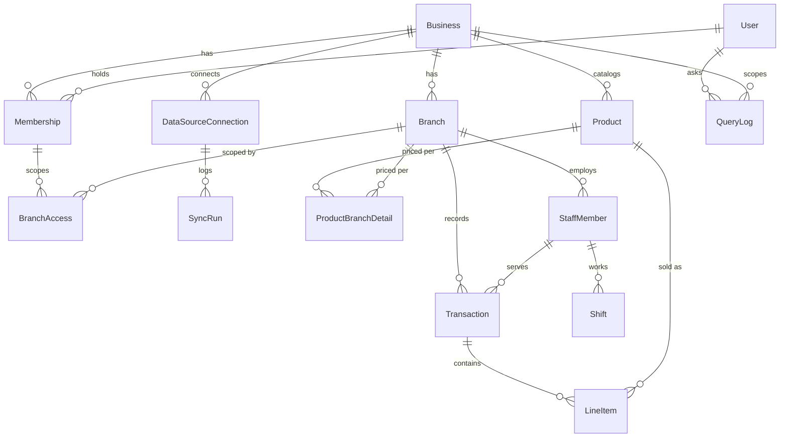

# Database Architecture

This is the full data model for the platform described in [PROJECT_FLOW.md](PROJECT_FLOW.md), organized by the same phases. It's written at the logical/Prisma level (matches the conventions already in [backend/prisma/schema.prisma](../backend/prisma/schema.prisma): camelCase fields, UUID primary keys, `createdAt`/`updatedAt`) so it can be transcribed into `schema.prisma` directly when a phase starts — it is not itself the schema file.

Every table below is tagged with the phase that introduces it. Build only what the current phase needs; the later tables are here so early tables are designed to not need breaking changes when they arrive (e.g. `Transaction.paymentMethod` exists from Phase 1 even though nothing reads it for anomaly detection until Phase 5).

---

## 1. Conventions

- **Primary keys:** `id String @id @default(uuid())` on every table.
- **Tenant isolation:** every table that holds business data carries `businessId` (indexed FK to `Business`), even where it's reachable transitively through another FK — this is what lets the tenant-resolution middleware filter with a single predicate instead of walking joins, and what an automated cross-tenant-access test (Phase 7) checks against.
- **Timestamps:** `createdAt DateTime @default(now())` on every table; `updatedAt DateTime @updatedAt` on anything mutable. Tables that are pure event/audit logs (`QueryLog`, `AuditLog`, `SyncRun`) omit `updatedAt` — they're append-only by design.
- **Money:** `Decimal @db.Decimal(12, 2)`, never `Float`. Every table that stores an amount also stores its own `currency` (ISO 4217) rather than assuming the business's default, because a franchise network can span currencies.
- **Soft state over hard delete:** financial and audit-relevant rows (`Transaction`, `RoyaltyStatement`, `Alert`) are never physically deleted — they carry a `status` enum (`VOIDED`, `DISMISSED`, etc.) instead, so the audit trail and traceability guarantees hold.
- **JSON columns** (Postgres `Jsonb`) are used only for genuinely semi-structured, non-queried-on data: source traces, root-cause hints, external API payloads. Anything the app needs to filter or join on is a real column.

---

## 2. Core Entity Relationships (MVP spine)

---

## 3. Phase 0 — Foundations

### `Business`
Top-level tenant. One row per company using the platform.

| Column | Type | Notes |
|---|---|---|
| id | String (uuid) | PK |
| name | String | |
| industry | Enum: `RETAIL, FOOD_BEVERAGE, SERVICES, FRANCHISE_OTHER` | |
| country | String (ISO 3166) | drives compliance regime (Phase 7) |
| defaultCurrency | String (ISO 4217) | |
| defaultLocale | Enum: `EN, HI, GU` | |
| timezone | String (IANA) | |
| createdAt / updatedAt | DateTime | |

### `Branch`
| Column | Type | Notes |
|---|---|---|
| id | String (uuid) | PK |
| businessId | String | FK → Business, indexed |
| name | String | |
| code | String | unique per business, matches POS location code where possible |
| city / region / country | String | region used for grouping in cross-branch comparison (FR-07) |
| latitude / longitude | Decimal, nullable | needed later for weather correlation (Phase 5) and expansion what-if (Phase 6) — capture at creation, not retrofitted; also doubles as the Attendance module's punch-in geofence center |
| geofenceRadiusMeters | Int, nullable | Attendance module: set alongside latitude/longitude to require staff to punch in/out within this radius; unset = no geofence enforced |
| timezone | String | |
| currency | String, nullable | overrides Business.defaultCurrency if set |
| status | Enum: `ACTIVE, INACTIVE, CLOSED` | |
| openedAt | DateTime, nullable | |
| createdAt / updatedAt | DateTime | |

### `User`
Global login identity — not tenant-scoped itself (a person could belong to more than one business, e.g. a consultant), so it does not carry `businessId`.

| Column | Type | Notes |
|---|---|---|
| id | String (uuid) | PK |
| email | String | unique |
| passwordHash | String | |
| name | String | |
| phone | String, nullable | |
| preferredLocale | Enum: `EN, HI, GU` | default for query answers/voice |
| status | Enum: `ACTIVE, INVITED, DISABLED` | |
| createdAt / updatedAt | DateTime | |

### `Membership`
One row per (user, business) — carries the role. Replaces a naive `User.businessId` column, which couldn't model a consultant or franchisor-with-multiple-businesses.

| Column | Type | Notes |
|---|---|---|
| id | String (uuid) | PK |
| userId | String | FK → User |
| businessId | String | FK → Business |
| role | Enum: `OWNER, ADMIN, MANAGER, STAFF` | per PRD Section 8 |
| status | Enum: `INVITED, ACTIVE, REVOKED` | `INVITED` is not currently set by any code path — "invited, no account yet" is modeled by `Invite` below instead, since a Membership row requires a real `userId`. Kept for a future self-serve accept/decline step on an *existing* account being invited to a *new* business, which isn't built yet either. |
| invitedAt / joinedAt | DateTime, nullable | |
| unique | (userId, businessId) | one role per person per business |

### `BranchAccess`
Explicit branch scoping for `MANAGER`/`STAFF` roles (a manager can cover more than one branch). `OWNER`/`ADMIN` roles ignore this table — they have implicit all-branch access within the business.

| Column | Type | Notes |
|---|---|---|
| id | String (uuid) | PK |
| membershipId | String | FK → Membership |
| branchId | String | FK → Branch |
| unique | (membershipId, branchId) | |

### `Invite`
A pending invite for an email with no BizIQ account yet — added alongside the Team screen so an owner can invite someone who hasn't signed up, not just someone who already has. Deliberately its own model rather than a `Membership` in `INVITED` status: `Membership.userId` is required (a membership is always for a real person). Signup checks for a `PENDING` match on the submitted email and, if found, joins that business with the stored role/branches instead of creating a new one — see `auth.service.js` and `invite.service.js`.

| Column | Type | Notes |
|---|---|---|
| id | String (uuid) | PK |
| businessId | String | FK → Business |
| email | String | lowercased before every read/write |
| role | Enum: `OWNER, ADMIN, MANAGER, STAFF` | never actually `OWNER` in practice — only `ADMIN`/`MANAGER`/`STAFF` are invitable |
| branchIds | String[] | branches to grant `BranchAccess` for once claimed; empty for `ADMIN` (implicit full access) |
| status | Enum: `PENDING, ACCEPTED, REVOKED` | `REVOKED` is defined but nothing sets it yet — there's no "cancel an invite" action built |
| invitedAt / acceptedAt | DateTime, nullable | |
| unique | (businessId, email) | re-inviting the same email to the same business updates this row rather than creating a second one |

---

## 4. Phase 1 — Data Ingestion

### `DataSourceConnection`
One row per connected POS/data source per business (or per branch, for POS systems that authenticate per-location).

| Column | Type | Notes |
|---|---|---|
| id | String (uuid) | PK |
| businessId | String | FK → Business |
| branchId | String, nullable | FK → Branch; null = business-wide connector that maps to branches internally |
| provider | String | e.g. `CSV_UPLOAD`, `SQUARE`, `GENERIC_REST` — open string, not a closed enum, so adding a POS vendor is data not a migration |
| displayName | String | |
| authConfig | Jsonb, encrypted at rest | API keys/tokens — encrypted via application-layer envelope encryption, not plain column |
| status | Enum: `CONNECTED, ERROR, DISCONNECTED, PENDING` | |
| syncFrequency | Enum: `MANUAL, HOURLY, DAILY` | |
| lastSyncedAt | DateTime, nullable | |
| createdAt / updatedAt | DateTime | |

### `SyncRun`
Append-only ingestion job log — needed to show "last synced: 2 hours ago" and to debug ingestion failures.

| Column | Type | Notes |
|---|---|---|
| id | String (uuid) | PK |
| dataSourceConnectionId | String | FK |
| startedAt / finishedAt | DateTime | |
| status | Enum: `RUNNING, SUCCESS, PARTIAL, FAILED` | |
| recordsIngested | Int | |
| errorMessage | String, nullable | |
| sourceFileName | String, nullable | for CSV/manual uploads |

### `Product`
Business-level catalog (shared across branches; price/availability varies per branch via `ProductBranchDetail`).

| Column | Type | Notes |
|---|---|---|
| id | String (uuid) | PK |
| businessId | String | FK → Business |
| name | String | |
| sku / externalId | String, nullable | POS-native identifier, used for de-dup on re-sync |
| category | String, nullable | |
| unit | String | e.g. `piece`, `kg`, `litre` |
| createdAt / updatedAt | DateTime | |

### `ProductBranchDetail`
| Column | Type | Notes |
|---|---|---|
| id | String (uuid) | PK |
| productId | String | FK → Product |
| branchId | String | FK → Branch |
| costPrice / sellPrice | Decimal | for margin/wastage-cost calculations |
| isActive | Boolean | |
| unique | (productId, branchId) | |

### `Transaction`
The core sales fact table. Every metric in the catalog (Phase 2) ultimately aggregates this.

| Column | Type | Notes |
|---|---|---|
| id | String (uuid) | PK |
| businessId | String | FK, indexed — denormalized from branch for fast tenant filtering |
| branchId | String | FK → Branch, indexed |
| dataSourceConnectionId | String, nullable | FK — which connector ingested this row |
| externalId | String, nullable | POS's own order id |
| occurredAt | DateTime | indexed — every period/comparison query filters on this |
| staffMemberId | String, nullable | FK → StaffMember |
| totalAmount / taxAmount / discountAmount | Decimal | |
| currency | String | |
| paymentMethod | Enum: `CASH, CARD, UPI, WALLET, OTHER, MIXED` | drives cash/digital mix anomaly detection (FR-12) from day one, even though nothing reads it until Phase 5 |
| status | Enum: `COMPLETED, REFUNDED, VOIDED` | never hard-deleted |
| createdAt | DateTime | |
| unique | (branchId, externalId) | idempotent re-sync |
| index | (businessId, branchId, occurredAt) | primary query path |

### `LineItem`
| Column | Type | Notes |
|---|---|---|
| id | String (uuid) | PK |
| transactionId | String | FK → Transaction |
| productId | String, nullable | FK → Product; null if POS sent an unmatched line |
| productNameSnapshot | String | preserved even if the product is later renamed/removed |
| quantity | Decimal | |
| unitPrice / lineTotal | Decimal | |
| costPriceSnapshot | Decimal, nullable | for margin calculation independent of later price changes |

### `InventoryItem`
| Column | Type | Notes |
|---|---|---|
| id | String (uuid) | PK |
| businessId | String | FK |
| name | String | |
| unit | String | |
| category | String, nullable | |

### `InventoryUsage`
Daily usage/wastage per branch per item — backs FR-11 (wastage tracking).

| Column | Type | Notes |
|---|---|---|
| id | String (uuid) | PK |
| businessId | String | FK |
| branchId | String | FK |
| inventoryItemId | String | FK |
| date | Date | |
| quantityUsed / quantityWasted | Decimal | |
| wastageReason | String, nullable | |
| costImpact | Decimal, nullable | |
| source | Enum: `SYSTEM_CALCULATED, MANUAL_ENTRY` | |
| index | (businessId, branchId, date) | |

### `StaffMember`
POS/HR record — distinct from `User`, because most cashiers/cooks never log into the app. `userId` links the two only when a staff member also has app access.

| Column | Type | Notes |
|---|---|---|
| id | String (uuid) | PK |
| businessId | String | FK |
| branchId | String | FK |
| userId | String, nullable | FK → User |
| name | String | |
| role | String | e.g. cashier, cook, manager |
| externalId | String, nullable | POS-native id |
| baseSalary | Decimal, nullable | Attendance module: monthly salary payroll pro-rates against. Null until an owner sets it — POS-synced staff have no payroll relationship with this app by default |
| status | Enum: `ACTIVE, INACTIVE` | |

### `Shift`
POS/rota concept — can be attributed to a `Transaction`, can be scheduled without ever happening, and a business can run more than one per staff member per day. Kept separate from `Attendance` below, which is the payroll-facing daily record.

| Column | Type | Notes |
|---|---|---|
| id | String (uuid) | PK |
| staffMemberId | String | FK |
| branchId | String | FK |
| startedAt / endedAt | DateTime | |
| scheduledStart / scheduledEnd | DateTime, nullable | actual vs. scheduled feeds staff analytics (Phase 6) |

---

## 4a. Attendance & Salary Slip module

Added outside the original phase sequence, on request. Builds on `StaffMember`
(Phase 1) rather than introducing a parallel employee table — an employee is
still one `StaffMember` row, optionally linked to a `User` via `userId`; that
link is what makes a StaffMember "punch-capable" from the app (self-service
punch-in/out resolves the caller's own StaffMember by `userId`, never by a
client-supplied id). Getting a real person into this path is two steps that
already existed: invite them as a `Membership` (any role) so they can
authenticate, then have an owner/admin/manager create a `StaffMember` row
with `userId` set to link the two.

### `Attendance`
One row per staff member per calendar day — the punch-in/out + status record
payroll reads. Distinct from `Shift` (above) rather than an extension of it.

| Column | Type | Notes |
|---|---|---|
| id | String (uuid) | PK |
| businessId / branchId | String | FK, denormalized from staffMember for fast branch/day roster queries |
| staffMemberId | String | FK |
| date | Date | unique with staffMemberId — one attendance record per person per day |
| status | Enum: `PRESENT, ABSENT, HALF_DAY, LEAVE` | set by punch-in (PRESENT) or a manager override (`POST .../attendance/mark`) |
| punchInAt / punchOutAt | DateTime, nullable | server time, never trusts a client-supplied timestamp |
| punchInLat / punchInLng / punchOutLat / punchOutLng | Decimal, nullable | captured per event; validated against the branch's geofence (if configured) before the punch is accepted |
| notes | String, nullable | free text, set via the manager-override endpoint |

### `SalarySlip`
One row per staff member per payroll month; regenerating the same
(staffMemberId, monthYear) overwrites rather than duplicating.

| Column | Type | Notes |
|---|---|---|
| id | String (uuid) | PK |
| businessId | String | FK |
| staffMemberId | String | FK |
| monthYear | String | e.g. `2026-09` |
| totalDaysWorked | Decimal | PRESENT = 1, HALF_DAY = 0.5, ABSENT/LEAVE = 0 (leave is unpaid — there's no leave-balance/policy model yet) |
| grossPay | Decimal | `(baseSalary / daysInMonth) * totalDaysWorked` |
| deductions | Decimal | manually entered at generation time — no tax/advance subsystem yet |
| netPay | Decimal | grossPay − deductions |
| currency | String | copied from `Business.defaultCurrency` at generation time |
| status | Enum: `DRAFT, FINALIZED` | `FINALIZED` isn't set by any code path yet — reserved for a future "lock the slip" action |
| generatedAt | DateTime | |

No `slip_url`/cloud storage column: the PDF is generated on demand
(`GET .../salary-slips/:id/pdf`, via `pdfmake`) straight from these numbers
rather than persisted to a file store this project doesn't have set up yet.

---

## 5. Phase 2–4 — Query Engine & Reporting

These tables don't hold business data — they log how the query engine used the tables above, which is what makes every answer traceable (NFR: Answer Accuracy & Traceability) and lets the "% of answers verified correct" success metric be measured at all.

### `Conversation`
| Column | Type | Notes |
|---|---|---|
| id | String (uuid) | PK |
| businessId | String | FK |
| userId | String | FK |
| startedAt | DateTime | |

### `QueryLog`
Append-only. One row per question asked, whether or not it was answered successfully.

| Column | Type | Notes |
|---|---|---|
| id | String (uuid) | PK |
| conversationId | String, nullable | FK |
| businessId | String | FK, indexed |
| userId | String | FK |
| channel | Enum: `TEXT, VOICE` | |
| locale | Enum: `EN, HI, GU` | |
| rawQueryText | String | the transcribed/typed question, verbatim |
| resolvedMetric | String, nullable | which metrics-catalog entry matched (e.g. `sales_by_period`) |
| resolvedParams | Jsonb, nullable | `{branchIds, dateRange, comparisonTarget}` |
| answerText | String, nullable | the generated NL answer |
| sourceTrace | Jsonb, nullable | the exact filters/values the answer was computed from — this is what the UI's "view source data" expand renders |
| status | Enum: `ANSWERED, UNRESOLVED, ERROR` | |
| latencyMs | Int | tracked against the 5s/15s performance NFR |
| createdAt | DateTime | |

### `QueryFeedback`
Thumbs up/down on an answer — the sampling mechanism for the "answer accuracy" success metric (PRD Section 9).

| Column | Type | Notes |
|---|---|---|
| id | String (uuid) | PK |
| queryLogId | String | FK |
| userId | String | FK |
| rating | Enum: `UP, DOWN` | |
| comment | String, nullable | |
| createdAt | DateTime | |

*(No new fact tables in Phase 4 — cross-branch comparison and dashboards query `Transaction`/`LineItem`/`InventoryUsage` directly through the same metrics catalog the chat interface uses, by design principle #2 in PROJECT_FLOW.md: dashboard and chat numbers must never be able to drift apart.)*

---

## 6. Phase 5 — Proactive Intelligence

### `Alert`
| Column | Type | Notes |
|---|---|---|
| id | String (uuid) | PK |
| businessId | String | FK |
| branchId | String, nullable | null = business-wide alert |
| type | Enum: `SALES_DECLINE, WASTAGE_SPIKE, CASH_MIX_DEVIATION, COST_PER_UNIT_RISE, OTHER` | |
| severity | Enum: `LOW, MEDIUM, HIGH` | |
| title / description | String | plain-language, ready to display |
| rootCauseHints | Jsonb | array of contributing factors (FR-09), e.g. `[{"factor": "cost_per_unit", "delta": "+12%"}]` |
| metricSnapshot | Jsonb | the numbers that triggered it, for traceability |
| status | Enum: `OPEN, ACKNOWLEDGED, RESOLVED, DISMISSED` | never hard-deleted |
| detectedAt | DateTime | |
| resolvedAt | DateTime, nullable | |
| resolvedByUserId | String, nullable | FK |

### `AlertNotification`
Per-recipient delivery log — needed because alert visibility is role-scoped (staff get operational alerts only, per PRD Section 8), so delivery is fanned out per eligible user, not per alert.

| Column | Type | Notes |
|---|---|---|
| id | String (uuid) | PK |
| alertId | String | FK |
| userId | String | FK |
| channel | Enum: `PUSH, IN_APP` | |
| deliveredAt | DateTime | |
| readAt | DateTime, nullable | |

### `ExternalSignal`
Cache of weather/event data pulled for correlation (FR-10) — cached rather than fetched live per query, since forecast providers rate-limit and the data changes at most daily.

| Column | Type | Notes |
|---|---|---|
| id | String (uuid) | PK |
| branchId | String | FK |
| date | Date | |
| type | Enum: `WEATHER, LOCAL_EVENT, FESTIVAL` | |
| payload | Jsonb | raw provider response (forecast, event name) |
| source | String | provider name |
| fetchedAt | DateTime | |

---

## 7. Phase 6 — Strategic & Franchise Features

### `DemandForecast`
| Column | Type | Notes |
|---|---|---|
| id | String (uuid) | PK |
| businessId | String | FK |
| branchId | String | FK |
| productId | String, nullable | null = branch-level forecast, set = product-level |
| forecastDate | Date | |
| forecastedValue | Decimal | |
| confidenceLow / confidenceHigh | Decimal | |
| modelVersion | String | for reproducibility when the forecasting approach changes |
| generatedAt | DateTime | |

### `FranchiseAgreement`
| Column | Type | Notes |
|---|---|---|
| id | String (uuid) | PK |
| businessId | String | FK — the franchisor |
| branchId | String | FK — the franchisee branch |
| royaltyPercent | Decimal | |
| minimumGuaranteeAmount | Decimal, nullable | |
| effectiveFrom | Date | |
| effectiveTo | Date, nullable | |
| status | Enum: `ACTIVE, TERMINATED` | |

### `RoyaltyStatement`
The one table with real financial/legal weight — every value must be reconstructable from `Transaction` rows, to the cent, per the Phase 6 exit criterion in PROJECT_FLOW.md.

| Column | Type | Notes |
|---|---|---|
| id | String (uuid) | PK |
| franchiseAgreementId | String | FK |
| periodStart / periodEnd | Date | |
| grossSales | Decimal | computed from Transaction, never hand-entered |
| royaltyAmount | Decimal | |
| status | Enum: `DRAFT, ISSUED, PAID, DISPUTED` | never hard-deleted |
| sourceTrace | Jsonb | the exact transaction-query/filters used — the audit trail for the "to the cent" requirement |
| generatedAt / issuedAt / paidAt | DateTime, nullable | |

### `CandidateLocation`
Expansion what-if analysis (FR-15) — a scratch entity, not part of the operational branch network until (if) it's opened.

| Column | Type | Notes |
|---|---|---|
| id | String (uuid) | PK |
| businessId | String | FK |
| name | String | |
| city / region / country | String | |
| latitude / longitude | Decimal | |
| demographicProfile | Jsonb | population density, footfall estimate, nearby competition |
| estimatedPerformance | Jsonb | output of the nearest-neighbor model: comparable existing branches + projected metrics |
| createdByUserId | String | FK |
| createdAt | DateTime | |

---

## 8. Cross-cutting — `AuditLog`

Generic action log, needed from Phase 0 onward for RBAC accountability and, from Phase 6, for royalty-statement auditability.

| Column | Type | Notes |
|---|---|---|
| id | String (uuid) | PK |
| businessId | String | FK |
| userId | String, nullable | null = system-initiated action |
| action | String | e.g. `ROYALTY_STATEMENT_ISSUED`, `MEMBERSHIP_ROLE_CHANGED` |
| entityType / entityId | String | polymorphic reference to the affected row |
| metadata | Jsonb | |
| createdAt | DateTime | |

---

## 9. Multi-tenancy Enforcement

Two layers, per the NFR (no cross-tenant leakage under any condition):

1. **Application layer (from Phase 0):** tenant-resolution middleware derives `businessId` from the authenticated session and injects it into every Prisma query — never accepted from client input. Every model in this document carries an indexed `businessId` specifically so this filter is a single `WHERE` clause, never a join chain that could be forgotten on one endpoint.
2. **Database layer (Phase 7 hardening):** Postgres Row-Level Security policies on every tenant table, keyed to a session variable set per request, as defense-in-depth beneath the application layer — so a bug in the application filter fails closed instead of leaking data.

---

## 10. Phase → Table Map

| Phase | New tables |
|---|---|
| 0 — Foundations | `Business`, `Branch`, `User`, `Membership`, `BranchAccess`, `Invite` (added later, alongside the Team screen) |
| 1 — Data Ingestion | `DataSourceConnection`, `SyncRun`, `Product`, `ProductBranchDetail`, `Transaction`, `LineItem`, `InventoryItem`, `InventoryUsage`, `StaffMember`, `Shift` |
| 4a — Attendance & Salary Slip (ad hoc, built out of phase order) | `Attendance`, `SalarySlip` |
| 2–4 — Query Engine & Reporting | `Conversation`, `QueryLog`, `QueryFeedback` |
| 5 — Proactive Intelligence | `Alert`, `AlertNotification`, `ExternalSignal` |
| 6 — Strategic & Franchise | `DemandForecast`, `FranchiseAgreement`, `RoyaltyStatement`, `CandidateLocation` |
| Cross-cutting | `AuditLog` (from Phase 0) |
