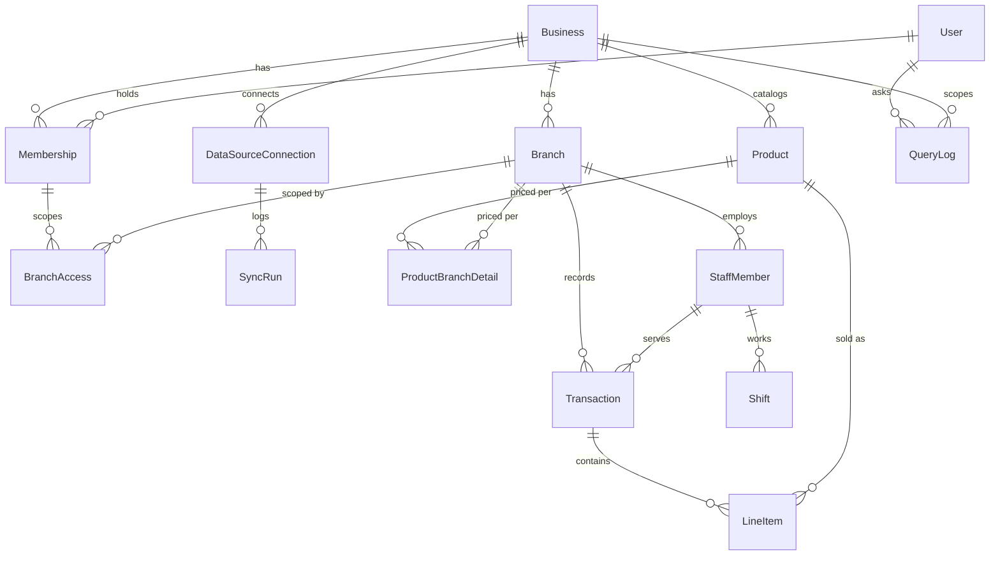

# Database Architecture

This is the full data model for the platform described in [PROJECT_FLOW.md](PROJECT_FLOW.md), organized by the same phases. It's written at the logical/Prisma level (matches the conventions already in [backend/prisma/schema.prisma](../backend/prisma/schema.prisma): camelCase fields, UUID primary keys, `createdAt`/`updatedAt`) so it can be transcribed into `schema.prisma` directly when a phase starts — it is not itself the schema file.

Every table below is tagged with the phase that introduces it. Build only what the current phase needs; the later tables are here so early tables are designed to not need breaking changes when they arrive (e.g. `Transaction.paymentMethod` exists from Phase 1 even though nothing reads it for anomaly detection until Phase 5).

---

## 1. Conventions

- **Primary keys:** `id String @id @default(uuid())` on every table.
- **Tenant isolation:** every table that holds business data carries `businessId` (indexed FK to `Business`), even where it's reachable transitively through another FK — this is what lets the tenant-resolution middleware filter with a single predicate instead of walking joins, and what an automated cross-tenant-access test (Phase 7) checks against.
- **Timestamps:** `createdAt DateTime @default(now())` on every table; `updatedAt DateTime @updatedAt` on anything mutable. Tables that are pure event/audit logs (`QueryLog`, `AuditLog`, `SyncRun`) omit `updatedAt` — they're append-only by design.
- **Money:** `Decimal @db.Decimal(12, 2)`, never `Float`. Every table that stores an amount also stores its own `currency` (ISO 4217) rather than assuming the business's default, because a franchise network can span currencies.
- **Soft state over hard delete:** financial and audit-relevant rows (`Transaction`, `RoyaltyStatement`, `Alert`) are never physically deleted — they carry a `status` enum (`VOIDED`, `DISMISSED`, etc.) instead, so the audit trail and traceability guarantees hold.
- **JSON columns** (Postgres `Jsonb`) are used only for genuinely semi-structured, non-queried-on data: source traces, root-cause hints, external API payloads. Anything the app needs to filter or join on is a real column.

---

## 2. Core Entity Relationships (MVP spine)



---

## 3. Phase 0 — Foundations

### `Business`
Top-level tenant. One row per company using the platform.

| Column | Type | Notes |
|---|---|---|
| id | String (uuid) | PK |
| name | String | |
| industry | Enum: `RETAIL, FOOD_BEVERAGE, SERVICES, FRANCHISE_OTHER` | |
| country | String (ISO 3166) | drives compliance regime (Phase 7) |
| defaultCurrency | String (ISO 4217) | |
| defaultLocale | Enum: `EN, HI, GU` | |
| timezone | String (IANA) | |
| createdAt / updatedAt | DateTime | |

### `Branch`
| Column | Type | Notes |
|---|---|---|
| id | String (uuid) | PK |
| businessId | String | FK → Business, indexed |
| name | String | |
| code | String | unique per business, matches POS location code where possible |
| city / region / country | String | region used for grouping in cross-branch comparison (FR-07) |
| latitude / longitude | Decimal, nullable | needed later for weather correlation (Phase 5) and expansion what-if (Phase 6) — capture at creation, not retrofitted; also doubles as the Attendance module's punch-in geofence center |
| geofenceRadiusMeters | Int, nullable | Attendance module: set alongside latitude/longitude to require staff to punch in/out within this radius; unset = no geofence enforced |
| timezone | String | |
| currency | String, nullable | overrides Business.defaultCurrency if set |
| status | Enum: `ACTIVE, INACTIVE, CLOSED` | |
| openedAt | DateTime, nullable | |
| createdAt / updatedAt | DateTime | |

### `User`
Global login identity — not tenant-scoped itself (a person could belong to more than one business, e.g. a consultant), so it does not carry `businessId`.

| Column | Type | Notes |
|---|---|---|
| id | String (uuid) | PK |
| email | String | unique |
| passwordHash | String | |
| name | String | |
| phone | String, nullable | |
| preferredLocale | Enum: `EN, HI, GU` | default for query answers/voice |
| status | Enum: `ACTIVE, INVITED, DISABLED` | |
| createdAt / updatedAt | DateTime | |

### `Membership`
One row per (user, business) — carries the role. Replaces a naive `User.businessId` column, which couldn't model a consultant or franchisor-with-multiple-businesses.

| Column | Type | Notes |
|---|---|---|
| id | String (uuid) | PK |
| userId | String | FK → User |
| businessId | String | FK → Business |
| role | Enum: `OWNER, ADMIN, MANAGER, STAFF, WAREHOUSE, CASHIER, DELIVERY_AGENT` | The vocabulary only — **what each role may do is not in the database.** It lives in `backend/src/permissions/catalog.js`, mirrored to `frontend/src/permissions/matrix.json` and gated by `npm run lint:permissions` in CI. The last three arrived with the Branch Operations track; see section 11. |
| status | Enum: `INVITED, ACTIVE, REVOKED` | `REVOKED` is what "remove this person" writes (`POST /memberships/:id/revoke`) — a soft revoke, because deleting the row would null `Attendance.markedByMembershipId` on every day they ever marked. `resolveTenant` requires `ACTIVE`, so a revoke takes effect on the person's very next request without any token invalidation. Re-inviting the same email flips the row back to `ACTIVE` with the new invite's role, which is the only way back in. `INVITED` is still set by no code path — "invited, no account yet" is modeled by `Invite` below instead, since a Membership row requires a real `userId`. Kept for a future self-serve accept/decline step on an *existing* account being invited to a *new* business, which isn't built yet either. |
| invitedAt / joinedAt | DateTime, nullable | |
| unique | (userId, businessId) | one role per person per business |

### `BranchAccess`
Explicit branch scoping for the branch-scoped roles — `CASHIER`, `DELIVERY_AGENT` and `STAFF` — any of which can cover more than one branch.

Which roles ignore this table is **not a hardcoded list**: it is whoever holds the `branch:allAccess` capability, read by `resolveTenant` to decide the `req.branchAccess === null` sentinel. Today that is `OWNER`, `ADMIN`, `MANAGER` and `WAREHOUSE`.

Two things worth knowing:

- **`MANAGER` left this table's audience in requirement 14.** A manager's rows still exist and can still be removed, but they no longer bound what that person reaches. The invite screen stops asking for branches for that role.
- **`branch:allAccess` is not authority over people.** `WAREHOUSE` holds it — the order desk ships to every branch — and deliberately does not hold `staff:viewAllBranches`, so it cannot read any branch's staff records or attendance. The sentinel used to conflate the two, which was safe only while the set was {OWNER, ADMIN}.

| Column | Type | Notes |
|---|---|---|
| id | String (uuid) | PK |
| membershipId | String | FK → Membership |
| branchId | String | FK → Branch |
| unique | (membershipId, branchId) | |

### `Invite`
A pending invite for an email with no BizIQ account yet — added alongside the Team screen so an owner can invite someone who hasn't signed up, not just someone who already has. Deliberately its own model rather than a `Membership` in `INVITED` status: `Membership.userId` is required (a membership is always for a real person). Signup checks for a `PENDING` match on the submitted email and, if found, joins that business with the stored role/branches instead of creating a new one — see `auth.service.js` and `invite.service.js`.

| Column | Type | Notes |
|---|---|---|
| id | String (uuid) | PK |
| businessId | String | FK → Business |
| email | String | lowercased before every read/write |
| role | Enum: `OWNER, ADMIN, MANAGER, STAFF` | never actually `OWNER` in practice — only `ADMIN`/`MANAGER`/`STAFF` are invitable |
| branchIds | String[] | branches to grant `BranchAccess` for once claimed; empty for `ADMIN` (implicit full access) |
| status | Enum: `PENDING, ACCEPTED, REVOKED` | `REVOKED` is set by `DELETE /invites/:id` (withdrawing an invite nobody claimed). Kept rather than deleted, partly for the history and partly because the unique constraint below means re-inviting the same address simply revives this row. An `ACCEPTED` invite cannot be revoked — it is a Membership now, and that is `revokeMembership`'s job |
| invitedAt / acceptedAt | DateTime, nullable | |
| unique | (businessId, email) | re-inviting the same email to the same business updates this row rather than creating a second one |

---

## 4. Phase 1 — Data Ingestion

### `DataSourceConnection`
One row per connected POS/data source per business (or per branch, for POS systems that authenticate per-location).

| Column | Type | Notes |
|---|---|---|
| id | String (uuid) | PK |
| businessId | String | FK → Business |
| branchId | String, nullable | FK → Branch; null = business-wide connector that maps to branches internally |
| provider | String | e.g. `CSV_UPLOAD`, `SQUARE`, `GENERIC_REST` — open string, not a closed enum, so adding a POS vendor is data not a migration |
| displayName | String | |
| authConfig | Jsonb, encrypted at rest | API keys/tokens — encrypted via application-layer envelope encryption, not plain column |
| status | Enum: `CONNECTED, ERROR, DISCONNECTED, PENDING` | |
| syncFrequency | Enum: `MANUAL, HOURLY, DAILY` | |
| lastSyncedAt | DateTime, nullable | |
| createdAt / updatedAt | DateTime | |

### `SyncRun`
Append-only ingestion job log — needed to show "last synced: 2 hours ago" and to debug ingestion failures.

| Column | Type | Notes |
|---|---|---|
| id | String (uuid) | PK |
| dataSourceConnectionId | String | FK |
| startedAt / finishedAt | DateTime | |
| status | Enum: `RUNNING, SUCCESS, PARTIAL, FAILED` | |
| recordsIngested | Int | |
| errorMessage | String, nullable | |
| sourceFileName | String, nullable | for CSV/manual uploads |

### `Product`
The catalog. Two scopes in one table, per requirement 4 — see section 11.

| Column | Type | Notes |
|---|---|---|
| id | String (uuid) | PK |
| businessId | String | FK → Business |
| branchId | String, nullable | **NULL = the whole business sells it**; a value = only that branch does ("every branch can add their own separate products"). One nullable column rather than a join table, so "this branch's catalog" is one filter instead of a union. `ON DELETE SET NULL`: deleting a branch must not silently delete products |
| name | String | |
| sku / externalId | String, nullable | POS-native identifier, used for de-dup on re-sync |
| category | String, nullable | groups the catalog on screen |
| unit | String | e.g. `piece`, `kg`, `litre` |
| costPrice / sellPrice | Decimal, nullable | the **business-wide default**, overridden per branch by `ProductBranchDetail`. Nullable because CSV ingestion discovers products from sales rows, which carry a line's unit price but no catalog price |
| isActive | Boolean, default true | withdraw from sale without deleting. Deleting is not available once `LineItem` rows reference it — a past sale must keep naming what was sold |
| createdAt / updatedAt | DateTime | |

### `ProductBranchDetail`
One branch's **override** of the business-wide price, not the only place a price can live. A product priced the same everywhere therefore needs no rows here at all, which is what stops this table growing to products × branches for no reason.

| Column | Type | Notes |
|---|---|---|
| id | String (uuid) | PK |
| productId | String | FK → Product |
| branchId | String | FK → Branch |
| costPrice / sellPrice | Decimal | required here, unlike on `Product`: an override exists precisely to state a price, and a half-stated one would silently fall back for the other half — which reads as the override not working |
| isActive | Boolean | **AND-ed** with `Product.isActive`, never an override of it. A branch may withdraw something others still sell; it cannot re-activate something the business has switched off |
| unique | (productId, branchId) | one override per branch, which is also what lets the upsert be race-free |

`product.service.js`'s `withEffectivePricing` resolves the fallback in one place — the catalog screen, the counter order (Task 4) and the day-end export (Task 9) all need the same answer, and disagreeing about a price is the kind of bug nobody notices until the till is short.

### `Transaction`
The core sales fact table. Every metric in the catalog (Phase 2) ultimately aggregates this.

| Column | Type | Notes |
|---|---|---|
| id | String (uuid) | PK |
| businessId | String | FK, indexed — denormalized from branch for fast tenant filtering |
| branchId | String | FK → Branch, indexed |
| dataSourceConnectionId | String, nullable | FK — which connector ingested this row |
| externalId | String, nullable | POS's own order id |
| occurredAt | DateTime | indexed — every period/comparison query filters on this |
| staffMemberId | String, nullable | FK → StaffMember |
| totalAmount / taxAmount / discountAmount | Decimal | |
| currency | String | |
| paymentMethod | Enum: `CASH, CARD, UPI, WALLET, OTHER, MIXED, UNSPECIFIED` | drives cash/digital mix anomaly detection (FR-12) from day one, even though nothing reads it until Phase 5. `UNSPECIFIED` exists because a counter order (Branch Operations Task 4) has no payment step while this column is required — writing `OTHER` instead would put a permanent lie into the very metric the column exists for |
| status | Enum: `COMPLETED, REFUNDED, VOIDED` | never hard-deleted |
| createdAt | DateTime | |
| unique | (branchId, externalId) | idempotent re-sync |
| index | (businessId, branchId, occurredAt) | primary query path |

### `LineItem`
| Column | Type | Notes |
|---|---|---|
| id | String (uuid) | PK |
| transactionId | String | FK → Transaction |
| productId | String, nullable | FK → Product; null if POS sent an unmatched line |
| productNameSnapshot | String | preserved even if the product is later renamed/removed |
| quantity | Decimal | |
| unitPrice / lineTotal | Decimal | |
| costPriceSnapshot | Decimal, nullable | for margin calculation independent of later price changes |

### `InventoryItem`
| Column | Type | Notes |
|---|---|---|
| id | String (uuid) | PK |
| businessId | String | FK |
| name | String | |
| unit | String | |
| category | String, nullable | |

### `InventoryUsage`
Daily usage/wastage per branch per item — backs FR-11 (wastage tracking).

| Column | Type | Notes |
|---|---|---|
| id | String (uuid) | PK |
| businessId | String | FK |
| branchId | String | FK |
| inventoryItemId | String | FK |
| date | Date | |
| quantityUsed / quantityWasted | Decimal | |
| wastageReason | String, nullable | |
| costImpact | Decimal, nullable | |
| source | Enum: `SYSTEM_CALCULATED, MANUAL_ENTRY` | |
| index | (businessId, branchId, date) | |

### `StaffMember`
POS/HR record — distinct from `User`, because most cashiers/cooks never log into the app. `userId` links the two only when a staff member also has app access.

| Column | Type | Notes |
|---|---|---|
| id | String (uuid) | PK |
| businessId | String | FK |
| branchId | String | FK |
| userId | String, nullable | FK → User |
| name | String | |
| role | String | e.g. cashier, cook, manager |
| externalId | String, nullable | POS-native id |
| baseSalary | Decimal, nullable | Attendance module: monthly salary payroll pro-rates against. Null until an owner sets it — POS-synced staff have no payroll relationship with this app by default |
| status | Enum: `ACTIVE, INACTIVE` | |

### `Shift`
POS/rota concept — can be attributed to a `Transaction`, can be scheduled without ever happening, and a business can run more than one per staff member per day. Kept separate from `Attendance` below, which is the payroll-facing daily record.

| Column | Type | Notes |
|---|---|---|
| id | String (uuid) | PK |
| staffMemberId | String | FK |
| branchId | String | FK |
| startedAt / endedAt | DateTime | |
| scheduledStart / scheduledEnd | DateTime, nullable | actual vs. scheduled feeds staff analytics (Phase 6) |

---

## 4a. Attendance, Payroll & Salary Slips

Added outside the original phase sequence, on request. Builds on `StaffMember`
(Phase 1) rather than introducing a parallel employee table — an employee is
still one `StaffMember` row, optionally linked to a `User` via `userId`; that
link is what makes a StaffMember "punch-capable" from the app (self-service
punch-in/out resolves the caller's own StaffMember by `userId`, never by a
client-supplied id). Getting a real person into this path is two steps that
already existed: invite them as a `Membership` (any role) so they can
authenticate, then have an owner/admin/manager create a `StaffMember` row
with `userId` set to link the two.

### The work calendar — `Business.weeklyOffDays`, `Branch.weeklyOffDays`, `Holiday`

Payroll divides by **working** days, not calendar days:

```
workingDays = calendar days − week-offs − holidays     (per branch, per month)
```

Week-offs and holidays are **paid by construction** — they appear in neither
the divisor nor the numerator — so missing one costs nothing, and someone
present on every working day earns exactly their salary. The first version
divided by calendar days, which paid a person with Sundays off about 87% of
their salary.

| Column | Type | Notes |
|---|---|---|
| `Business.weeklyOffDays` | Int[] default `[0]` | 0 = Sunday … 6 = Saturday, matching JS `getUTCDay()`. `[]` means the business works every day |
| `Business.unmarkedWorkingDayStatus` | Enum: `PRESENT, ABSENT` default `PRESENT` | what a working day with no record means at payroll time. `PRESENT` makes payroll exception-based (mark absences; silence means worked) — the safe default, because under `ABSENT` a business that doesn't punch daily would see every salary zeroed |
| `Branch.weeklyOffOverride` | Boolean default `false` | Prisma has no nullable scalar list, and `[]` is a legitimate value ("this branch works seven days"), so the override is an explicit flag rather than a sentinel |
| `Branch.weeklyOffDays` | Int[] default `[]` | used only when `weeklyOffOverride` is true; wins **whole**, never merged with the business list |

#### `Holiday`
Paid non-working days. `branchId` null applies to the whole business; a branch
row overrides a business-wide row for that branch on that date.

| Column | Type | Notes |
|---|---|---|
| id | String (uuid) | PK |
| businessId | String | FK |
| branchId | String, nullable | null = every branch |
| date | Date | unique with (businessId, branchId) — but Postgres treats NULL `branchId` as distinct, so that unique does **not** stop two business-wide rows on one date. Prisma 5 cannot emit `NULLS NOT DISTINCT`, so `workCalendar.service.js` pre-checks on create and its calculator dedupes into a Map keyed by date, making a duplicate harmless to the maths |
| name | String | shown on the payslip |
| isPaid | Boolean default true | `false` is the rare unpaid-shutdown case. It only affects how the payslip labels the day — a holiday is excluded from working days either way |

### `Attendance`
One row per staff member per calendar day — the punch-in/out + status record
payroll reads.

The date is the **branch's** calendar day, resolved through `Branch.timezone`.
It was previously the server's UTC day, which for IST filed every punch before
05:30 local against the previous date.

| Column | Type | Notes |
|---|---|---|
| id | String (uuid) | PK |
| businessId / branchId | String | FK, denormalized from staffMember for fast branch/day roster queries |
| staffMemberId | String | FK |
| date | Date | unique with staffMemberId — one attendance record per person per day |
| status | Enum: `PRESENT, ABSENT, HALF_DAY, LEAVE` | set by punch-in (PRESENT) or a manager override (`POST .../attendance/mark`) |
| punchInAt / punchOutAt | DateTime, nullable | server time, never trusts a client-supplied timestamp |
| punchInLat / punchInLng / punchOutLat / punchOutLng | Decimal, nullable | captured per event; validated against the branch's geofence (if configured) before the punch is accepted |
| notes | String, nullable | free text, set via the manager-override endpoint |
| markedByMembershipId | String, nullable | FK → `Membership`, `onDelete: SetNull`. Who overrode this day when it wasn't a punch, so a disputed absence is traceable. Cheap to record, impossible to backfill later |

Marking someone `ABSENT`/`LEAVE` clears the punch timestamps — the row used to
be able to claim both "absent" and "punched in at 09:02" at once.

### `SalarySlip`
One row per staff member per payroll month; regenerating the same
(staffMemberId, monthYear) overwrites rather than duplicating.

| Column | Type | Notes |
|---|---|---|
| id | String (uuid) | PK |
| businessId | String | FK |
| branchId | String | FK. Added so slips can be branch-filtered — without it the list endpoint had to be OWNER/ADMIN-only for want of a scope |
| staffMemberId | String | FK |
| monthYear | String | e.g. `2026-09` |
| baseSalary | Decimal | **snapshot** of the person's salary at generation time |
| workingDays | Decimal | **snapshot** of the divisor actually used |
| daysPresent / daysHalfDay / daysAbsent / daysLeave / daysPending | Decimal default 0 | working days only. `daysPending` is working days still in the future when a mid-month slip was generated — pending, not absent |
| daysWeeklyOff / daysHoliday | Decimal default 0 | paid, and outside the divisor. Listed so the employee can see they were paid for them |
| totalDaysWorked | Decimal | `daysPresent + 0.5 × daysHalfDay`. LEAVE is unpaid (weight 0) but counted separately from ABSENT so the payslip tells the truth |
| grossPay | Decimal | `baseSalary ÷ workingDays × totalDaysWorked`, computed with `Prisma.Decimal` — never floats |
| deductions | Decimal | manually entered — no tax/advance subsystem yet. An omitted value on regeneration now means "leave it as it was"; it used to silently reset to 0 |
| deductionNote | String, nullable | why money came off, printed on the payslip |
| netPay | Decimal | `max(0, grossPay − deductions)` — floored, because it could previously go negative |
| currency | String | copied from `Business.defaultCurrency` at generation time |
| status | Enum: `DRAFT, FINALIZED` | a FINALIZED slip refuses regeneration with a 409 — the enum finally means something |
| generatedAt / finalizedAt | DateTime | |

The basis is snapshotted (`baseSalary`, `workingDays`, the day buckets) so that
a later change to the weekly off, the holiday calendar or the person's salary
can never silently restate a payslip an employee has already been shown.
Finalizing is what locks it against regeneration.

No `slip_url`/cloud storage column: the payslip is rendered on demand as HTML
(`GET .../salary-slips/:id/document?lang=`, from `backend/src/documents/`) and
printed to PDF by the device, rather than persisted to a file store this
project doesn't have set up. The old `pdfmake` PDF route could not render `₹`
or any Indic script — it used base-14 Helvetica with no embedded font — which
is why the document is HTML now.

### `StaffMember` additions

| Column | Type | Notes |
|---|---|---|
| phone | String, nullable | printed on the payslip |
| employeeCode | String, nullable | human-facing payroll id. Distinct from `externalId`, which is a POS id. Deliberately not unique — unique-with-NULLs in Postgres would still allow any number of staff with no code |
| hiredOn / exitedOn | Date, nullable | shrink the **numerator** only: days outside employment leave the divisor untouched, so a joiner on the 15th earns roughly half a month. Shrinking the divisor instead would pay them a full month |
| deactivatedAt | DateTime, nullable | pairs with `status`, making a deactivation auditable rather than just a flag |
| notes | String, nullable | free text on the edit form |

### `Shift` — removed

`Shift` was declared in Phase 1 and never written to by any code path. It was
dropped in the working-days migration (verified 0 rows first). `Attendance` was
always the payroll record; a real rota feature would reintroduce `Shift`
properly rather than overloading `Attendance`.

---

## 5. Phase 2–4 — Query Engine & Reporting

These tables don't hold business data — they log how the query engine used the tables above, which is what makes every answer traceable (NFR: Answer Accuracy & Traceability) and lets the "% of answers verified correct" success metric be measured at all.

### `Conversation`
| Column | Type | Notes |
|---|---|---|
| id | String (uuid) | PK |
| businessId | String | FK |
| userId | String | FK |
| startedAt | DateTime | |

### `QueryLog`
Append-only. One row per question asked, whether or not it was answered successfully.

| Column | Type | Notes |
|---|---|---|
| id | String (uuid) | PK |
| conversationId | String, nullable | FK |
| businessId | String | FK, indexed |
| userId | String | FK |
| channel | Enum: `TEXT, VOICE` | |
| locale | Enum: `EN, HI, GU` | |
| rawQueryText | String | the transcribed/typed question, verbatim |
| resolvedMetric | String, nullable | which metrics-catalog entry matched (e.g. `sales_by_period`) |
| resolvedParams | Jsonb, nullable | `{branchIds, dateRange, comparisonTarget}` |
| answerText | String, nullable | the generated NL answer |
| sourceTrace | Jsonb, nullable | the exact filters/values the answer was computed from — this is what the UI's "view source data" expand renders |
| status | Enum: `ANSWERED, UNRESOLVED, ERROR` | |
| latencyMs | Int | tracked against the 5s/15s performance NFR |
| createdAt | DateTime | |

### `QueryFeedback`
Thumbs up/down on an answer — the sampling mechanism for the "answer accuracy" success metric (PRD Section 9).

| Column | Type | Notes |
|---|---|---|
| id | String (uuid) | PK |
| queryLogId | String | FK |
| userId | String | FK |
| rating | Enum: `UP, DOWN` | |
| comment | String, nullable | |
| createdAt | DateTime | |

*(No new fact tables in Phase 4 — cross-branch comparison and dashboards query `Transaction`/`LineItem`/`InventoryUsage` directly through the same metrics catalog the chat interface uses, by design principle #2 in PROJECT_FLOW.md: dashboard and chat numbers must never be able to drift apart.)*

---

## 6. Phase 5 — Proactive Intelligence

### `Alert`
| Column | Type | Notes |
|---|---|---|
| id | String (uuid) | PK |
| businessId | String | FK |
| branchId | String, nullable | null = business-wide alert |
| type | Enum: `SALES_DECLINE, WASTAGE_SPIKE, CASH_MIX_DEVIATION, COST_PER_UNIT_RISE, OTHER` | |
| severity | Enum: `LOW, MEDIUM, HIGH` | |
| title / description | String | plain-language, ready to display |
| rootCauseHints | Jsonb | array of contributing factors (FR-09), e.g. `[{"factor": "cost_per_unit", "delta": "+12%"}]` |
| metricSnapshot | Jsonb | the numbers that triggered it, for traceability |
| status | Enum: `OPEN, ACKNOWLEDGED, RESOLVED, DISMISSED` | never hard-deleted |
| detectedAt | DateTime | |
| resolvedAt | DateTime, nullable | |
| resolvedByUserId | String, nullable | FK |

### `AlertNotification`
Per-recipient delivery log — needed because alert visibility is role-scoped (staff get operational alerts only, per PRD Section 8), so delivery is fanned out per eligible user, not per alert.

| Column | Type | Notes |
|---|---|---|
| id | String (uuid) | PK |
| alertId | String | FK |
| userId | String | FK |
| channel | Enum: `PUSH, IN_APP` | |
| deliveredAt | DateTime | |
| readAt | DateTime, nullable | |

### `ExternalSignal`
Cache of weather/event data pulled for correlation (FR-10) — cached rather than fetched live per query, since forecast providers rate-limit and the data changes at most daily.

| Column | Type | Notes |
|---|---|---|
| id | String (uuid) | PK |
| branchId | String | FK |
| date | Date | |
| type | Enum: `WEATHER, LOCAL_EVENT, FESTIVAL` | |
| payload | Jsonb | raw provider response (forecast, event name) |
| source | String | provider name |
| fetchedAt | DateTime | |

---

## 7. Phase 6 — Strategic & Franchise Features

### `DemandForecast`
| Column | Type | Notes |
|---|---|---|
| id | String (uuid) | PK |
| businessId | String | FK |
| branchId | String | FK |
| productId | String, nullable | null = branch-level forecast, set = product-level |
| forecastDate | Date | |
| forecastedValue | Decimal | |
| confidenceLow / confidenceHigh | Decimal | |
| modelVersion | String | for reproducibility when the forecasting approach changes |
| generatedAt | DateTime | |

### `FranchiseAgreement`
| Column | Type | Notes |
|---|---|---|
| id | String (uuid) | PK |
| businessId | String | FK — the franchisor |
| branchId | String | FK — the franchisee branch |
| royaltyPercent | Decimal | |
| minimumGuaranteeAmount | Decimal, nullable | |
| effectiveFrom | Date | |
| effectiveTo | Date, nullable | |
| status | Enum: `ACTIVE, TERMINATED` | |

### `RoyaltyStatement`
The one table with real financial/legal weight — every value must be reconstructable from `Transaction` rows, to the cent, per the Phase 6 exit criterion in PROJECT_FLOW.md.

| Column | Type | Notes |
|---|---|---|
| id | String (uuid) | PK |
| franchiseAgreementId | String | FK |
| periodStart / periodEnd | Date | |
| grossSales | Decimal | computed from Transaction, never hand-entered |
| royaltyAmount | Decimal | |
| status | Enum: `DRAFT, ISSUED, PAID, DISPUTED` | never hard-deleted |
| sourceTrace | Jsonb | the exact transaction-query/filters used — the audit trail for the "to the cent" requirement |
| generatedAt / issuedAt / paidAt | DateTime, nullable | |

### `CandidateLocation`
Expansion what-if analysis (FR-15) — a scratch entity, not part of the operational branch network until (if) it's opened.

| Column | Type | Notes |
|---|---|---|
| id | String (uuid) | PK |
| businessId | String | FK |
| name | String | |
| city / region / country | String | |
| latitude / longitude | Decimal | |
| demographicProfile | Jsonb | population density, footfall estimate, nearby competition |
| estimatedPerformance | Jsonb | output of the nearest-neighbor model: comparable existing branches + projected metrics |
| createdByUserId | String | FK |
| createdAt | DateTime | |

---

## 8. Cross-cutting — `AuditLog`

Generic action log, needed from Phase 0 onward for RBAC accountability and, from Phase 6, for royalty-statement auditability.

| Column | Type | Notes |
|---|---|---|
| id | String (uuid) | PK |
| businessId | String | FK |
| userId | String, nullable | null = system-initiated action |
| action | String | e.g. `ROYALTY_STATEMENT_ISSUED`, `MEMBERSHIP_ROLE_CHANGED` |
| entityType / entityId | String | polymorphic reference to the affected row |
| metadata | Jsonb | |
| createdAt | DateTime | |

---

## 9. Multi-tenancy Enforcement

Two layers, per the NFR (no cross-tenant leakage under any condition):

1. **Application layer (from Phase 0):** tenant-resolution middleware derives `businessId` from the authenticated session and injects it into every Prisma query — never accepted from client input. Every model in this document carries an indexed `businessId` specifically so this filter is a single `WHERE` clause, never a join chain that could be forgotten on one endpoint.
2. **Database layer (Phase 7 hardening):** Postgres Row-Level Security policies on every tenant table, keyed to a session variable set per request, as defense-in-depth beneath the application layer — so a bug in the application filter fails closed instead of leaking data.

---

## 10. Phase → Table Map

| Phase | New tables |
|---|---|
| 0 — Foundations | `Business`, `Branch`, `User`, `Membership`, `BranchAccess`, `Invite` (added later, alongside the Team screen) |
| 1 — Data Ingestion | `DataSourceConnection`, `SyncRun`, `Product`, `ProductBranchDetail`, `Transaction`, `LineItem`, `InventoryItem`, `InventoryUsage`, `StaffMember`, `Shift` |
| 4a — Attendance, Payroll & Salary Slips (ad hoc, built out of phase order) | `Attendance`, `SalarySlip`, `Holiday` |
| 2–4 — Query Engine & Reporting | `Conversation`, `QueryLog`, `QueryFeedback` |
| 5 — Proactive Intelligence | `Alert`, `AlertNotification`, `ExternalSignal` |
| 6 — Strategic & Franchise | `DemandForecast`, `FranchiseAgreement`, `RoyaltyStatement`, `CandidateLocation` |
| Branch Operations (a separate track — see section 11) | `CounterOrder`, `CounterOrderItem`, `BranchTokenCounter`, `DayClose`, `SupplyOrder`, `SupplyOrderItem`, `SupplyOrderEvent`, `Expense`, `ExpenseCategory`, `DeviceToken`, `Notification` |
| Cross-cutting | `AuditLog` (from Phase 0) |

---

## 11. Branch Operations — planned tables

A second track running alongside the phase sequence, driven by
[REQUIREMENTS.md](REQUIREMENTS.md), which turns BizIQ from a product that
analyses a business into one that runs it. **None of these tables exist yet** —
they are listed here so the tables that do exist are designed not to need
breaking changes when they arrive, which is the same reason sections 5–7 are
written ahead of their phases.

Task 1 of that track (roles and the capability matrix) has landed, and its two
schema changes are recorded in place above: the three new `MembershipRole`
values on `Membership`, and `PaymentMethod.UNSPECIFIED` on `Transaction`.

**Counter billing (R1) — ✅ built, see the tables in section 12.**

**Supply orders (R3, R5, R9, R11, R12).** `SupplyOrder` carries the status
machine (`DRAFT → PLACED → ACCEPTED → PACKED → DISPATCHED → DELIVERED`, with
`CANCELLED` before dispatch), the payment mode and its reference string, and the
promised arrival. `DRAFT` **is** the cart, so it survives closing the app.
`SupplyOrderEvent` is append-only and covers order tracking, material tracking,
the dispatch record, the "+30 minutes, traffic" delays from both the warehouse
and the delivery agent, and the audit trail — one table rather than four
half-overlapping ones. The raw-material catalog reuses `InventoryItem`, which
has been in the schema since Phase 1 with no API on it.

**Expenses (R10).** `Expense` + `ExpenseCategory`, per branch per day.
"Which branches haven't logged today" needs no table — it is a left join
computed when someone opens the screen, and therefore exact, where a nightly
snapshot would be wrong minutes after it ran.

**Notifications (R2, R8).** `DeviceToken` is per device per **user**, not per
membership: a phone belongs to a person, and one person acts under several
businesses. Its `token` is unique so that re-registering after a logout *moves*
the row rather than leaving the previous user receiving pushes on a phone they
signed out of. It also carries the **device's** locale, which is what lets the
push sender render text in the right language without violating the rule that
the backend does not translate — see the notification section of
[REQUIREMENTS.md](REQUIREMENTS.md). `Notification` stores `code` + `params`,
never prose, exactly as the error catalog does.

---

## 12. Counter billing — built (Branch Operations Task 4)

Requirement 1's tables. Migration `20260924163804_counter_billing`.

### `CounterOrder`
One customer's order at a counter. **Not** a sales fact table — see the projection note below.

| Column | Type | Notes |
|---|---|---|
| id | String (uuid) | PK |
| businessId / branchId | String | FK |
| tokenNumber | Int | what the customer is called by |
| tokenDate | Date | the **branch's** local date, via `todayKeyInZone`. Keyed on UTC, a branch in `Asia/Kolkata` restarts its numbering at 05:30 local, mid-breakfast |
| status | Enum `OPEN, CLOSED, VOID` | `CLOSED` means handed over, **not** frozen — requirement 1 asks for orders to stay editable after they are taken. The freeze is `DayClose` |
| totalAmount | Decimal(12,2) | recomputed from the items on every mutation, never adjusted, so it cannot drift from the lines it totals |
| currency | String | branch currency, falling back to the business default |
| paymentMethod | Enum `PaymentMethod` | defaults `UNSPECIFIED`: requirement 1 has no payment step, and writing `OTHER` would corrupt the cash-mix metric |
| placedByMembershipId | String, nullable | who rang it up. From the session, never the request body |
| transactionId | String, nullable, **unique** | the projection. One order, one transaction. `SetNull` so deleting a transaction cannot orphan the order that explains it |
| openedAt / closedAt / updatedAt | DateTime | |
| unique | (branchId, tokenDate, tokenNumber) | **not the allocator** — the assertion that the allocator is correct, the same posture `Attendance` takes with its no-double-punch key |

### `CounterOrderItem`
| Column | Type | Notes |
|---|---|---|
| id | String (uuid) | PK |
| counterOrderId | String | FK, Cascade |
| productId | String, nullable | null for a one-off with no catalog entry |
| productNameSnapshot | String | snapshotted at ring-up. Renaming or repricing a product next week must not rewrite what this receipt said |
| quantity | Decimal(12,3) | |
| unitPrice / lineTotal | Decimal(12,2) | the price comes from the catalog, resolved for this branch — a price the client can name is a price the client can invent |

### `BranchTokenCounter`
The allocator. Composite PK `(branchId, tokenDate)`, incremented by one atomic statement:

```sql
INSERT INTO branch_token_counters ("branchId", "tokenDate", "lastNumber")
VALUES ($1::uuid, $2::date, 1)
ON CONFLICT ("branchId", "tokenDate")
DO UPDATE SET "lastNumber" = branch_token_counters."lastNumber" + 1
RETURNING "lastNumber"
```

The project's first deliberate `$queryRaw`, because Prisma cannot express `ON CONFLICT DO UPDATE SET x = x + 1` and every alternative is worse: `MAX+1` races two cashiers on one counter, a retry loop degrades exactly when the counter is busiest (a 500 while a customer stands there), and a Postgres sequence is not per-branch-per-day, needs runtime DDL and never resets.

### `DayClose`
| Column | Type | Notes |
|---|---|---|
| id | String (uuid) | PK |
| businessId / branchId | String | FK |
| date | Date | matches `CounterOrder.tokenDate` |
| closedAt / closedByMembershipId | | |
| unique | (branchId, date) | |

The floor on editing. Requirement 1 wants orders editable after they are placed; requirement 17 exports the day. Without a floor, an edit after the export silently restates a number someone has already been shown. Closing refuses while orders are still `OPEN`, and reopening is deliberately available — a day closed by mistake with hours of trading left must be recoverable, or the guard is a trap.

### The projection

Every counter mutation runs `salesProjection.service.js`'s `writeTransaction` inside the same `prisma.$transaction`, under `externalId = "counter:<orderId>"` against the existing `@@unique([branchId, externalId])`. Upsert + delete-lines + recreate makes it **idempotent**, which is what makes editing free — it just runs again. `VOID` projects as `TransactionStatus.VOIDED`, which `getSalesSummary`'s existing `status: 'COMPLETED'` filter already excludes with no new code.

`Transaction.source` (`TransactionSource`: `POS_IMPORT | COUNTER`) tells the two sources apart. `@default(POS_IMPORT)` backfilled every existing row correctly — everything already in there arrived by CSV upload.

One consequence worth knowing: `LineItem.id` is unstable across edits and the table churns. At a counter's volume that is nothing.

---

## 13. Supply orders — built (Branch Operations Task 5)

Requirements 3, 5, 5.1, 9, 11 and 12. A branch orders raw material from one central warehouse desk, the desk fulfils and dispatches it, an agent delivers it, and either end can post a delay the cashier sees.

**These tables are deliberately NOT projected into `Transaction`/`LineItem`.** A counter order is a *sale*; a supply order is an internal transfer and a *cost*. Writing it into the sales fact table would inflate every sales figure in the product by the value of the flour a branch bought from its own warehouse. Task 8 reads it from here as a cost input to net profit.

### `InventoryItem` — extended

Modelled in Phase 1 to track usage, with no API at all until requirement 5 gave it the job it was shaped for: this is the list a branch orders from.

| Column | Type | Notes |
|---|---|---|
| unitPrice | Decimal(12,2)? | **New.** What the warehouse charges for one `unit`. Nullable on purpose: items have existed here since Phase 1 without a price, and an unpriced item must be un-orderable rather than orderable at zero |
| isActive | Boolean | **New.** Withdrawn without deleting — deleting would orphan the history of every order that ever contained it |

Business-wide by design, unlike `Product`, which grew a nullable `branchId` in requirement 4. A branch sells its own menu; it does not keep a private list of flour.

Name uniqueness is a **service-level** check (case-insensitive), not a unique index — the same trade the `Holiday` model documents. Prisma 5 cannot express a functional unique index and hand-adding one in SQL would leave permanent drift against `schema.prisma`. Two simultaneous creates can still both land; that costs a duplicate row someone can withdraw.

### `SupplyOrder`

| Column | Type | Notes |
|---|---|---|
| id | String (uuid) | PK |
| businessId / branchId | String | FK |
| orderNumber | Int? | Null while it is a `DRAFT` cart. Issued at `PLACED` from `SupplyOrderCounter` |
| status | `SupplyOrderStatus` | `DRAFT | PLACED | ACCEPTED | PACKED | DISPATCHED | DELIVERED | CANCELLED` |
| totalAmount / currency | Decimal(12,2) / String | Recomputed from the items on every change, never adjusted |
| paymentMode | `SupplyPaymentMode?` | `ONLINE | COD`. Null on a draft; required to leave one |
| paymentStatus | `SupplyPaymentStatus` | `PENDING | PAID | VERIFIED | FAILED` |
| paymentReference | String? | What the warehouse checks against its own records |
| paymentVerifiedAt | DateTime? | |
| promisedAt | DateTime? | When it is currently expected. Each delay pushes it, when one was given |
| placedByMembershipId | String? | FK, `SetNull`. **Null until `PLACED`**, then whoever placed it. Kept because per-cashier reporting filters on it |
| deliveryAgentMembershipId | String? | FK, `SetNull`. Kept because the agent's queue filters on it |
| placedAt / dispatchedAt / deliveredAt / cancelledAt | DateTime? | |
| unique | (businessId, orderNumber) | |
| indexes | (businessId, status), (businessId, branchId, status), (deliveryAgentMembershipId, status) | the desk's query, the branch's, and the agent's |

**Only two membership columns, and both exist because a query filters on them.** Who accepted, packed, dispatched or verified the payment lives in `SupplyOrderEvent` — that table *is* the audit trail, and four more actor columns here would be a second record of the same fact, free to disagree with the first.

It is filled in at `PLACED` and not before, and that matters because the cart is shared: whoever opens it is often not whoever sends it. Stamping the opener made an order's header claim it was "placed by Hari" while its own history said Deep placed it — one act, two names.

`DRAFT` is the cart, one per **branch** rather than per cashier: the branch is what orders, and a per-person cart strands whatever someone had half-built when their shift ended. Find-then-create, for the same partial-index reason as above.

### `SupplyOrderItem`

| Column | Type | Notes |
|---|---|---|
| supplyOrderId | String | FK, `Cascade` |
| inventoryItemId | String? | FK, `SetNull` |
| itemNameSnapshot / unitSnapshot | String | Snapshotted, like `CounterOrderItem` — a rename next month must not rewrite what this order said |
| quantity | Decimal(12,3) | |
| unitPrice / lineTotal | Decimal(12,2) | Price taken from the catalog, never from the caller |
| unique | (supplyOrderId, inventoryItemId) | |

That unique key is the difference between a cart and a till roll: adding the same item twice raises the quantity instead of producing two lines a picker has to reconcile. `CounterOrderItem` deliberately has no equivalent.

### `SupplyOrderEvent`

| Column | Type | Notes |
|---|---|---|
| supplyOrderId | String | FK, `Cascade` |
| type | `SupplyOrderEventType` | `STATUS_CHANGE | DELAY | PAYMENT | ASSIGNMENT` |
| fromStatus / toStatus | `SupplyOrderStatus?` | |
| delayMinutes | Int? | requirement 9's "+30 minutes" |
| reasonCode | String? | A **code**, never prose |
| note | String? | The actor's own words, shown exactly as typed |
| actorMembershipId | String? | FK, `SetNull` |
| index | (supplyOrderId, createdAt) | |

One table covers requirement 5.1's whole list — material tracking, order tracking, dispatch and payment — because they are one stream of events. `reasonCode` follows the error catalog's contract for the same reason: the server cannot know whether the cashier reading it has the app in Gujarati, so the device renders `t('supplyDelay.<CODE>')`. The delay reasons are `TRAFFIC`, `STOCK_OUT`, `VEHICLE_ISSUE`, `WEATHER`, `STAFF_SHORTAGE`, `OTHER`; the payment codes are `PAYMENT_CLAIMED`, `PAYMENT_ON_DELIVERY`, `PAYMENT_VERIFIED`, `PAYMENT_FAILED`, `PAYMENT_COLLECTED`.

`PAYMENT_COLLECTED` (R22) is the cash-on-delivery entry in that story: the agent confirming the branch's money is in their hand, written beside the delivery rather than inside it. Before it, a COD order's `paymentStatus` moved to `PAID` as a side effect of arriving, with nothing anywhere recording who had taken the money. The delivery endpoint refuses to close a COD order without that confirmation, so the row is never missing from an order that claims to be paid.

`ASSIGNMENT` (R21) is who is carrying it, and is deliberately **not** a `STATUS_CHANGE`: handing a run to a different agent moves nothing along the status machine, and filing it as one would put a row in the timeline claiming a transition that never happened. Its `note` holds the agent's **name**, snapshotted the way `SupplyOrderItem.itemNameSnapshot` holds the item's, so the history still reads correctly after that person is renamed or leaves. That is not the backend writing prose — there is no sentence, only a name the device puts inside one of its own (`t('supply.assignedTo', { name })`). The *current* assignee is always `SupplyOrder.deliveryAgentMembershipId`; these rows are how it got there.

### `SupplyOrderCounter`

| Column | Type | Notes |
|---|---|---|
| businessId | String | PK, FK `Cascade` |
| lastNumber | Int | |

Allocated by the same atomic `INSERT … ON CONFLICT DO UPDATE … RETURNING` as `BranchTokenCounter`. Two differences: per **business**, and it never resets. A token is shouted across a counter and has to stay small; an order number is quoted days later ("where has 214 got to?") and has to stay unique over time.

---

## 14. Punch location — who fills it, and why (R20)

No schema change: `Attendance` has carried `punchInLat/Lng` and `punchOutLat/Lng` since the attendance module was built. What changed is that they stopped being incidental.

| Policy | Chosen by | Geofence | Coordinates |
|---|---|---|---|
| Fixed place of work | the default | applied where the branch configures one | needed only to check against it |
| `attendance:punchAnywhere` | `DELIVERY_AGENT` | **not applied** | **required** |

The second row is a trade, not a privilege. A delivery agent is at a different branch every hour, so a radius around one of them is meaningless — but accepting the punch without a location would remove the check and record nothing in its place. Requiring the coordinates is what keeps the day auditable, and it is why the capability is in `ADMIN_EXCLUDES`: an admin holding everything else would inherit the cost without needing the exemption.

`Attendance.branchId` still comes from `StaffMember.branchId`, and that stays true for an agent — it is their payroll home, not a claim about where they worked. Where they actually were is the coordinates.

These rows have a second reader now. `GET /supply-delivery-agents` (R21) reads today's attendance for each agent to answer "who is free": a `punchInAt` with no `punchOutAt` is `ON_DUTY`, a row that has been punched out of — or no row at all — is `OFF_DUTY`, and an agent with no `StaffMember` record is `UNKNOWN`, because attendance genuinely has nothing to say about them. "Today" is the branch's own calendar day, as everywhere else that reads attendance. `UNKNOWN` sorts *above* off duty on purpose: it is the state every agent is in at a business that does not use punch-in, and sinking them would bury the whole list.

---

## 15. `BranchKind` — a warehouse is a location (R23)

| Column | Type | Notes |
|---|---|---|
| `Branch.kind` | `BranchKind` | `BRANCH | WAREHOUSE`, `@default(BRANCH)` |

Adding a staff member requires a branch, because `Attendance`, `SalarySlip`, `StaffMember` and every roster query are keyed on `branchId`. A warehouse employee had nowhere to be filed — the only locations a business had were the places it sells from — so there was no way for them to punch in at all.

**A warehouse is therefore a `Branch`, distinguished by a kind, rather than a table of its own.** That is the whole point: as a Branch it has a timezone, coordinates, a geofence, staff, attendance, payslips and a roster on the day it is created. A separate `Warehouse` table would have needed all five of those modules taught about a second kind of place before anyone could punch in anywhere.

The column defaults to `BRANCH`, so every location that already existed stays what it was and there is no backfill.

What a warehouse may **not** do is enforced in the two services where goods move, not merely omitted from the pickers: `branchOf` in `counterOrder.service.js` and `supplyOrder.service.js` both throw `BRANCH_IS_WAREHOUSE` (400). A warehouse has no till, and an order it placed on itself would arrive at the desk asking the desk to ship to the desk. On the device the same split is one rule stated in `useBranches`: **`tradingBranches` where goods move, `branches` where people are.**

---

## 16. Branch delivery address (R21)

| Column | Type | Notes |
|---|---|---|
| `Branch.addressLine` | String? | Street, building, landmark. Free text and **multi-line** |
| `Branch.postalCode` | String? | |

`city`, `region` and `country` already existed and describe where a branch **is**, for reporting. They are not an address anybody can ride to, which is why these are separate columns rather than a stricter use of those. `addressLine` is deliberately unstructured: an Indian address is not a fixed set of fields, and forcing one drops the half that actually finds the place ("behind the old post office").

Both nullable. Every branch that existed before this column has neither, and a branch whose own staff know where it is never needs one — an order to such a branch shows "No address saved for this branch" rather than failing.

The destination travels on the supply order (`ORDER_INCLUDE.branch` selects it alongside `latitude`/`longitude`), because the delivery agent's order screen is the only thing they open and branch endpoints are not theirs to call. The map link prefers the coordinates when the branch has them and falls back to the written address.

